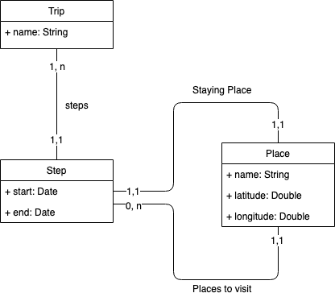

# Trip Manager Challenge Api  
  
This project has for purpose to challenge yourself to create an API from scratch.  
You have to create an application who manage the trips made by an user.

## Context

## Rules  
- Java 11 or later  
- SpringBoot 2 or later  
  - No Gradle, **Maven ONLY**
 - Choose a database Sql or NoSql

## Constraints
- No @autowired  : Following this [exemple](https://dzone.com/articles/spring-di-patterns-the-good-the-bad-and-the-ugly)
- Create has many immutable class has you can : Here an [exemple](https://dzone.com/articles/how-to-create-an-immutable-class-in-java)
- [DRY & KISS](https://dzone.com/articles/software-design-principles-dry-and-kiss)  
- 1 or More Unit Test with Junit 5 
- Readable and safe code
	- do not hesitate to use Lambda, Stream and Optional
- English Code Only
  
## Challenge
- Create a Git repo
- Init the project via [Spring Initializr](https://start.spring.io/)
- Create a documented Rest API
	- CRUD for each model
	- *(Optional)* A route for healthcheck and version of the application

**(Optional) Go further** :  
- Spring Actuator  
- Spring security  
- Flux & Mono